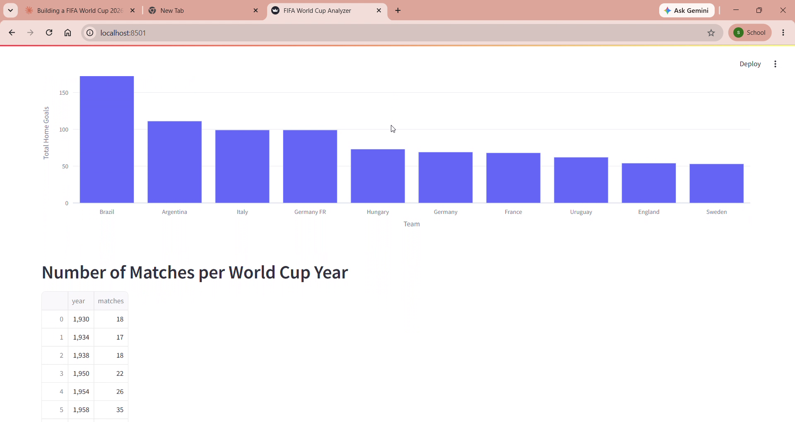
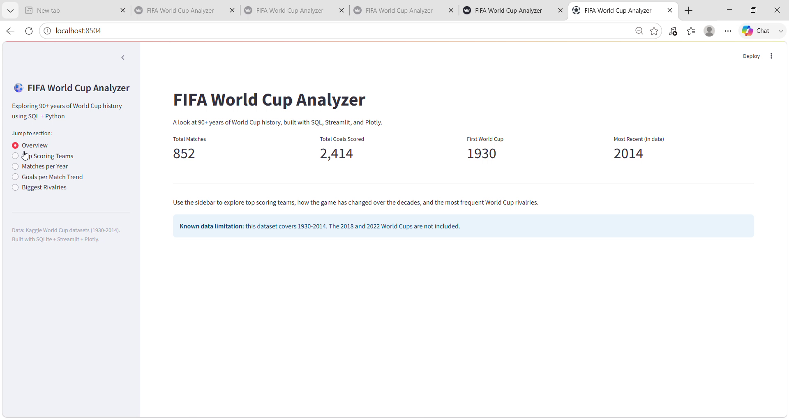
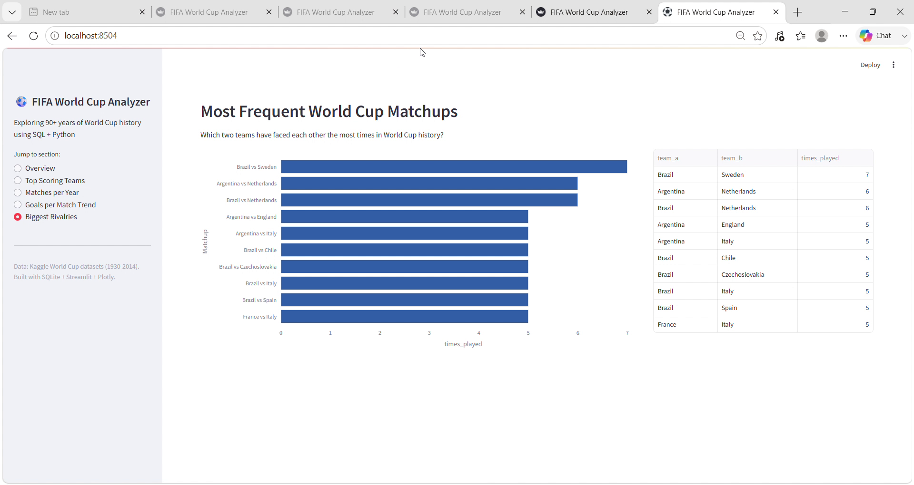
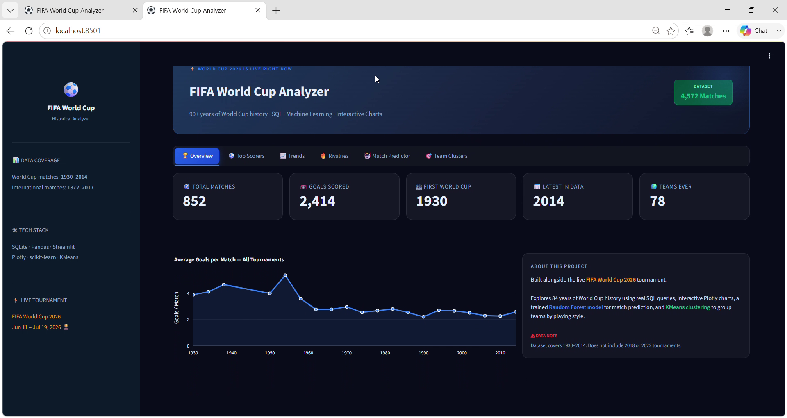
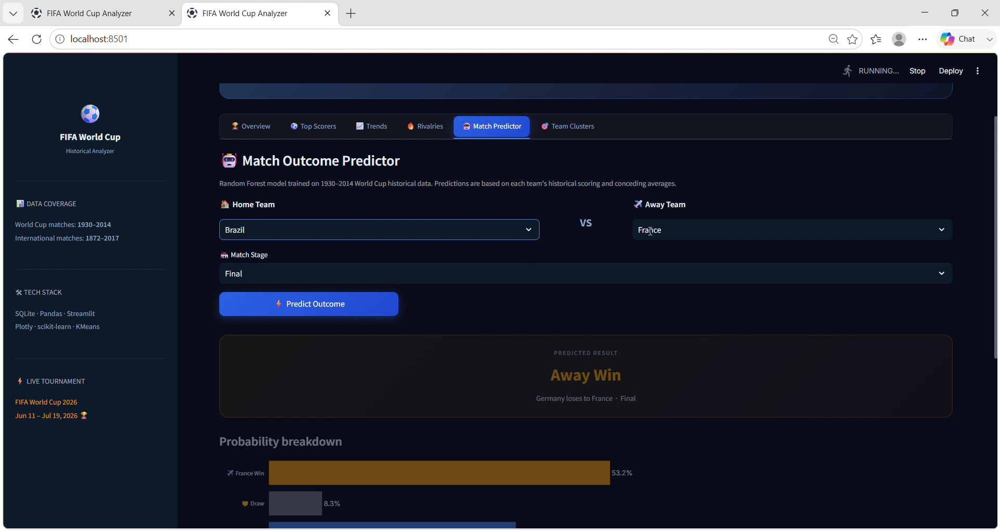
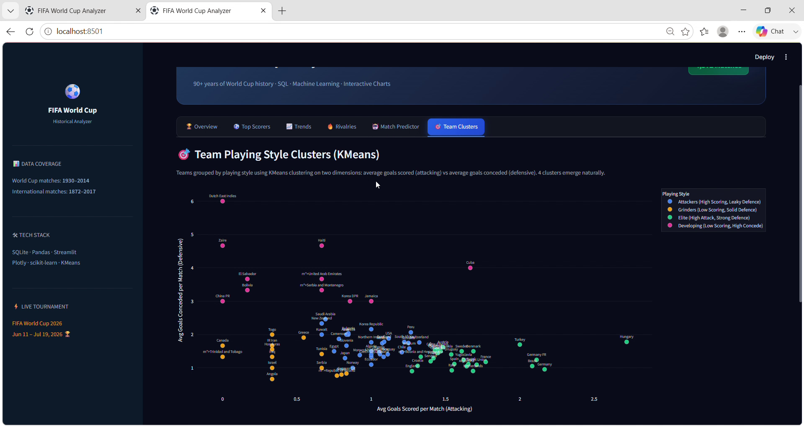

# FIFA World Cup Analyzer

Exploring 90+ years of FIFA World Cup history using SQL, Python, and interactive visualizations.

Built as a learning project to practice SQL, data analysis, and dashboard development -- timed alongside the FIFA World Cup 2026 tournament.

## Progress

**Before** -- initial working dashboard, all sections stacked vertically:

**After** -- added sidebar navigation, side-by-side layouts, headline metrics, and a consistent color theme:

**Latest** -- redesigned with a dark theme, top tab navigation, a live Match Outcome Predictor, and KMeans team playing-style clusters:

**NLP Features** -- Added Natural Language to SQL intent parsing and TextBlob Sentiment Analysis:

## What it does

- Loads historical football match data into a SQLite database
- Runs SQL queries to answer real questions about World Cup history:
  - Which teams have scored the most goals?
  - How has the average number of goals per match changed over the decades?
  - Which two teams have faced each other most often in World Cup history?
  - How many matches were played in each tournament year?
- Visualizes the results in an interactive Streamlit dashboard using Plotly charts
- Predicts match outcomes using a trained Random Forest classifier
- Groups teams into playing-style clusters using KMeans
- **[NEW]** Analyzes historical match commentary sentiment using TextBlob NLP
- **[NEW]** Translates plain English questions into SQL queries using an intent parser

## NLP & Machine Learning Features

**Ask the Data (Natural Language to SQL)** -- a rule-based intent parser allows users to type questions in plain English (e.g., "Who hosted the most matches?"). The app parses the text, translates it into the correct SQL query, executes it against the SQLite database, and returns the answer.

**Sentiment Analysis** -- uses the `TextBlob` NLP library to analyze mock historical sports commentary. It scores iconic World Cup moments on a polarity scale from -1.0 (negative/controversial) to +1.0 (thrilling/positive).

**Match Outcome Predictor** -- pick any two teams and a match stage, and a Random Forest classifier trained on 1930-2014 World Cup data predicts the outcome (home win / draw / away win) with a probability breakdown for each result.

**Team Playing Style Clusters** -- KMeans clustering groups all 78 World Cup teams into 4 playing-style categories based on two features: average goals scored per match (attacking strength) and average goals conceded per match (defensive strength). The four clusters that emerge: Attackers (high scoring, leaky defence), Grinders (low scoring, solid defence), Elite (high attack, strong defence), and Developing (low scoring, high concede).

**Known limitation:** both the predictor and the clusters use each team's *entire* historical average (1930-2014), not a time-aware "average up to that point" calculation. This means there is some data leakage -- a small amount of future information technically influences predictions about earlier matches. This is a deliberate simplification for this stage of the project; building leakage-free, time-aware features is listed in the roadmap below.

## Tech stack

- Python -- pandas for data loading and cleaning
- SQLite -- lightweight SQL database, no server required
- Streamlit -- web dashboard framework
- Plotly -- interactive charts

## Data sources

This project uses two public Kaggle datasets:

1. International football results, 1872-2017: https://www.kaggle.com/datasets/martj42/international-football-results-from-1872-to-2017
2. FIFA World Cup dataset: https://www.kaggle.com/datasets/abecklas/fifa-world-cup

Known data limitation: the World Cup matches dataset stops at 2014. It does not include the 2018 or 2022 tournaments, since the original dataset predates them.

## Setup instructions

1. Clone this repo:
   git clone https://github.com/sadniya/fifaworldcup-analyzer.git
   cd fifaworldcup-analyzer

2. Install dependencies:
   pip install pandas streamlit plotly scikit-learn textblob

3. Download the two datasets linked above from Kaggle, and place them in this structure:
   results.csv/results.csv
   worldcup.csv/WorldCupMatches.csv

4. Build the SQLite database:
   python build_database.py

5. Run the dashboard:
   python -m streamlit run dashboard.py

6. Open the URL shown in the terminal (usually http://localhost:8501) in your browser.

## Project structure

build_database.py -- loads CSVs into a SQLite database (fifa.db)
sql_queries.py -- standalone exploratory SQL queries (terminal output)
dashboard.py -- the Streamlit + Plotly dashboard
explore_data.py -- initial data exploration script
generate_sentiment.py -- runs TextBlob NLP on match commentary
train_model.py -- trains the Random Forest classifier
cluster_teams.py -- runs KMeans clustering

## What I learned

- Writing SQL queries with GROUP BY, aggregate functions, and CASE WHEN logic
- Loading pandas DataFrames into a SQL database with to_sql()
- Building an interactive dashboard with Streamlit
- Creating charts with Plotly Express
- Handling real-world messy data
- Training and evaluating a Random Forest classifier
- Using KMeans clustering for unsupervised learning
- Building a rule-based Natural Language to SQL intent parser
- Performing sentiment analysis with TextBlob

## Roadmap / next steps

- [ ] Migrate from SQLite to PostgreSQL
- [x] Add a goal/outcome prediction model trained on historical data
- [x] Add team clustering (playing style similarity) using KMeans
- [x] Add Natural Language Q&A intent parsing
- [x] Add sentiment analysis on World Cup news/social commentary
- [ ] Patch the 2018/2022 data gap
- [ ] Fix data leakage in model features (currently uses each team's full-history average, not time-aware averages -- see "Known limitations" below)

